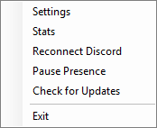
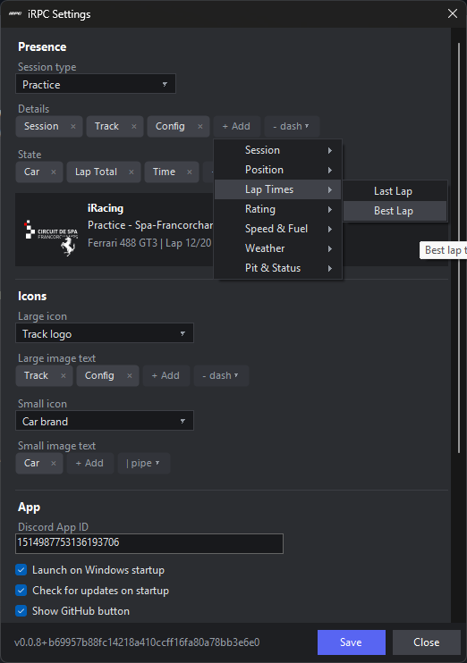
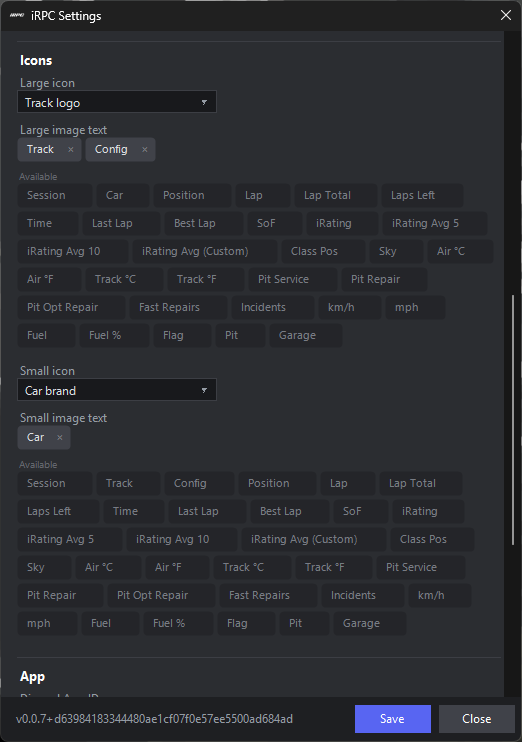
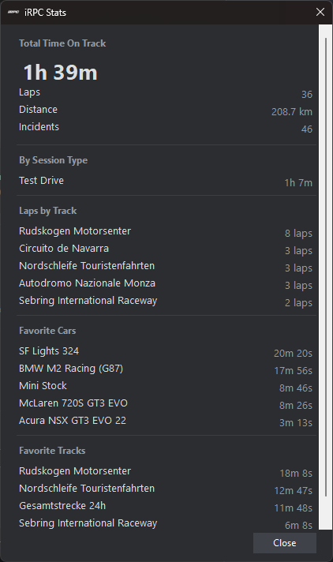

# iRPC

A lightweight Windows system tray app that shows your live iRacing session as Discord Rich Presence. Track, car, position, lap progress, fuel, weather, iRating, and more - all fully customizable.


---

## Features

- **Live session info in Discord** - track, car, session type, position, laps, time remaining, speed, fuel, last/best lap, weather, flags, pit and garage status
- **iRating and Strength of Field** - your live iRating, rolling averages (last 5 / 10 / custom races), and SoF using iRacing's own formula
- **Safety Rating tracking** - current SR plus rolling averages over the last 5, 10, or a custom number of races
- **Pit and damage tracking** - repair time remaining, fast repairs used/available, incident count
- **Per-session templates** - Practice, Qualify, Race, Test Drive, and Time Trial each get their own layout
- **Chip template editor** - click chips to build your presence, grouped by category with tooltips on each one. Classic text editor also available if you prefer it
- **Live preview in Settings** before saving
- **Track and car brand logos** pulled directly from GitHub - no Discord asset limit
- **Elapsed session timer** shown as a Discord timestamp
- **Stats window** - tracks your total time on track broken down by session type, car, and track
- **Presence presets** - save and switch between layouts instantly from the tray menu. Eight built-in presets included
- **Discord Profile Widget (Experimental)** - push live iRacing stats to your Discord profile card, visible to anyone who views your profile
- **Pause Presence** - hide your presence from the tray menu without closing the app
- **Launches on Windows startup** (optional)
- **Self-updating** - checks GitHub Releases, downloads, verifies, and installs with one click

---

## Requirements

- Windows 10 or 11
- [.NET 8 Desktop Runtime](https://dotnet.microsoft.com/en-us/download/dotnet/8.0) - if missing, Windows will prompt you to install it on first launch
- Discord (desktop app)
- iRacing

---

## Installation

1. Download `iRPC.exe` from the [latest release](https://github.com/aftermath-dev/iRPC/releases/latest)
2. Run it - a tray icon appears in the system tray
3. Open iRacing and start a session

No installer required.

---

## Tray Menu

Right-click the tray icon for:

| Item              | Description                                          |
|-------------------|------------------------------------------------------|
| Settings          | Opens the Settings window                            |
| Stats             | Opens the time-on-track Stats window                 |
| Presets           | Switch presence layout instantly from saved presets  |
| Reconnect Discord | Forces a fresh connection to the Discord client      |
| Pause Presence    | Temporarily hides your presence without closing iRPC |
| Check for Updates | Manually checks GitHub for a newer release           |
| Exit              | Closes iRPC and clears your Discord presence         |



---

## Settings

Right-click the tray icon - **Settings**

### Presence

Configure what appears on each line of the Discord presence. Pick a session type from the dropdown to customize each one independently.

**Details** and **State** are built using chips. Click a chip to add it to your template, drag to reorder, click × to remove. Hover any chip to see what it outputs. Chips are grouped by category (Session, Position, Lap Times, iRating, Speed & Fuel, Weather, Pit & Status). A classic text editor is also available under App settings if you prefer typing.



Available chips:

| Chip                 | Output                                             |
|----------------------|----------------------------------------------------|
| Session              | Session type (Race, Practice...)                   |
| Track                | Track name                                         |
| Config               | Track configuration (Full, Boot...)                |
| Car                  | Car name                                           |
| Position             | P1, P2... (empty outside race)                     |
| Class Pos            | Position within your car class (multiclass races)  |
| Lap                  | Current lap number                                 |
| Lap Total            | Lap X/Y progress                                   |
| Laps Left            | Laps remaining                                     |
| Time                 | Time remaining                                     |
| Last Lap             | Last lap time                                      |
| Best Lap             | Best lap time this session                         |
| SoF                  | Strength of Field                                  |
| iRating              | Your live iRating                                  |
| iRating Avg 5        | Average of your last 5 race-end iRatings           |
| iRating Avg 10       | Average of your last 10 race-end iRatings          |
| iRating Avg (Custom) | Average over a custom window (set in App settings) |
| SR                   | Your Safety Rating value (e.g. 3.44)               |
| SR Avg 5             | Average of your last 5 race-end SR values          |
| SR Avg 10            | Average of your last 10 race-end SR values         |
| SR Avg (Custom)      | Average over a custom window (set in App settings) |
| Sky                  | Current sky condition                              |
| Air °C / Air °F      | Air temperature                                    |
| Track °C / Track °F  | Track surface temperature                          |
| Pit Service          | Currently being serviced in the pits               |
| Pit Repair           | Mandatory damage repair time remaining             |
| Pit Opt Repair       | Optional/cosmetic repair time remaining            |
| Fast Repairs         | Fast repairs used/available this race              |
| Incidents            | Incident points this session                       |
| Inc. Limit           | Session incident limit (empty when there is none)  |
| Tire                 | Tire compound fitted (e.g. Soft, Primary)          |
| Car #                | Your car number (e.g. #47)                         |
| Class                | Your car class (e.g. GT3, GTP, LMP2)               |
| License              | Your license and safety rating (e.g. A 2.00)       |
| Series               | Series name from iRacing                           |
| Delta                | Current lap vs best lap (e.g. Δ +0.234)            |
| Stint                | Time on track since your last pit stop             |
| Gap Ahead            | Time gap to the car directly ahead                 |
| Gap Leader           | Time behind the race leader                        |
| Drivers              | Number of competitors in the session               |
| Laps Down            | Laps behind the race leader (empty on the lead lap)|
| Session Time         | Elapsed time in the session                        |
| Lap Time             | Current in-progress lap time                       |
| Gear                 | Current gear (R, N, 1, 2...)                       |
| RPM                  | Engine RPM                                         |
| km/h / mph           | Speed                                              |
| Fuel / Fuel %        | Fuel level / percentage                            |
| Fuel Laps            | Estimated laps of fuel remaining                   |
| Wind / Wind mph      | Wind speed and direction                           |
| Humidity             | Air humidity                                       |
| Wet                  | Shows "Wet" when iRacing has declared a wet track  |
| Time of Day          | The in-sim clock (e.g. 2:34 PM)                    |
| Flag                 | Current flag (Caution, Checkered, etc - text or emoji, set in App settings) |
| Pit                  | In Pits indicator                                  |
| Garage               | In Garage indicator                                |

### Icons

| Setting          | Description                                  |
|------------------|----------------------------------------------|
| Large icon       | iRacing logo, iRPC logo, or track logo       |
| Large image text | Text shown when hovering the large icon (built with chips) |
| Small icon       | Off, car brand logo, or session type icon                  |
| Small image text | Text shown when hovering the small icon (built with chips) |



### App

| Setting                      | Description                                                |
|------------------------------|------------------------------------------------------------|
| Discord App ID               | Discord application used for Rich Presence                 |
| Show GitHub button           | Show a link to this repo on the presence                   |
| Launch on startup            | Start iRPC automatically with Windows                      |
| Check for updates on startup | Silently check for a newer release each time iRPC launches |
| Auto-populate key overrides  | Append newly seen tracks/cars to `key_overrides.json`      |
| iRating average window       | Number of races used for the "Avg (Custom)" iRating chip   |
| SR average window            | Number of races used for the "SR Avg (Custom)" chip        |
| Debug mode                   | Enables verbose file logging to `iRPC.log`                 |

---

## Stats

Open via the tray menu - **Stats**. Shows your accumulated time on track, broken down by session type, car, and track. Saved locally, no account needed.



---

## Profile Widget (Experimental)

iRPC can push live iRacing stats to a Discord profile widget card that shows on your profile while you're in a session. This feature requires some one-time setup in the Discord Developer Portal.

> **Note:** Discord's profile widget API is not publicly released. It currently only shows for users who have the widget renderer experiment enabled on their Discord client. Availability will expand as Discord rolls it out.

### Setup

**1. Create a Discord application**

Go to [discord.com/developers](https://discord.com/developers), create a new application, then go to **Games → Social SDK** and fill out the form to enable Social SDK access. You get access instantly.

**2. Enable the widget editor**

Open the Developer Portal in a browser, open the browser console (`F12`), and run the experiment override snippet from the [Discord Previews server](https://discord.gg/discord-previews) to unlock the Widget page. Then create your widget layout under **Games → Widget**, using User Data fields with these exact names:

| Field name | Type |
|---|---|
| `SessionType` | Text |
| `MainIcon` | Image |
| `stat_1_label` / `stat_1_value` | Text |
| `stat_2_label` / `stat_2_value` | Text |
| ... up to `stat_6_label` / `stat_6_value` | Text |

Click **Publish** when done.

**3. Add a redirect URI**

In your application's **OAuth2** settings, add `http://localhost:7423/callback` as a redirect URI and save.

**4. Get your bot token**

Go to **Bot** in your application sidebar, click **Reset Token**, and copy the token.

**5. Configure iRPC**

Open iRPC Settings, scroll to **Profile Widget**:
- Paste your bot token into the **Bot token** field
- Enter your application's ID in the **Discord App ID** field (top of App settings)
- Click **Link Discord Account** and authorize in the browser that opens
- Check **Enable profile widget updates**
- Click **Save**

iRPC will push your stats every 30 seconds while you're in a session.

**6. Add the widget to your profile**

The widget won't appear on your profile automatically. Use the snippet from the [Discord Previews server](https://discord.gg/discord-previews) (run in your Discord client developer tools) to add the widget to your profile.

### Widget stats

The six stats pushed to the widget are fixed and drawn from your accumulated iRPC stats (the same data shown in the Stats window):

| Label | Value |
|---|---|
| Total Time on Track | Your total recorded time on track |
| Total Laps | Your total recorded lap count |
| Total Distance | Your total recorded distance (km) |
| Total Incidents | Your total recorded incident points |
| Favorite Vehicle | Car you've spent the most time in |
| Favorite Track | Track you've spent the most time at |

---

## Track & Brand Logos

Logos are served directly from `ArtAssets/Tracks/` and `ArtAssets/Brands/` in this repo - no Discord asset upload required. To add a logo, add a PNG with the right filename and push.

**Filename convention:** lowercase, spaces and hyphens replaced with underscores, prefixed with `track_` or `brand_`.

| Type         | Example  | Filename            |
|--------------|----------|---------------------|
| Track        | Spa      | `track_spa.png`     |
| Car brand    | Ferrari  | `brand_ferrari.png` |
| Session icon | Practice | `icon_practice.png` |

iRPC generates the asset key automatically from the track/car name reported by iRacing. If it doesn't match your filename, add a remap in `%AppData%\iRPC\key_overrides.json`:

```json
{
  "track_spa_francorchamps": "track_spa"
}
```

Common remaps are pre-seeded. Enable Debug Mode to see exactly which key and URL the app is resolving each session.

---

## Building from Source

Requires [.NET 8 SDK](https://dotnet.microsoft.com/download/dotnet/8).

```powershell
git clone https://github.com/aftermath-dev/iRPC.git
cd iRPC
dotnet run
```

To publish a release build:

```powershell
dotnet publish -c Release -r win-x64 -p:SelfContained=false -p:PublishSingleFile=true -p:AssemblyName=iRPC
```

Output: `bin/Release/net8.0-windows/win-x64/publish/iRPC.exe` (~1 MB, requires .NET 8 runtime)

---

## Logs & Data Files

| File                                  | Contents                                                            |
|---------------------------------------|---------------------------------------------------------------------|
| `%AppData%\iRPC\iRPC.log`             | Debug log - poll ticks, YAML updates, resolved image URLs           |
| `%AppData%\iRPC\settings.json`        | App settings                                                        |
| `%AppData%\iRPC\stats.json`           | Time-on-track stats (session type / car / track)                    |
| `%AppData%\iRPC\irating_history.json` | Your recorded race-end iRatings, used for rolling averages          |
| `%AppData%\iRPC\sr_history.json`      | Your recorded race-end Safety Ratings, used for rolling averages    |
| `%AppData%\iRPC\key_overrides.json`   | Asset key remaps (e.g. `track_spa_francorchamps` -> `track_spa`)    |
| `%AppData%\iRPC\tracks.txt`           | Every unique track seen, auto-appended per session (if enabled)     |
