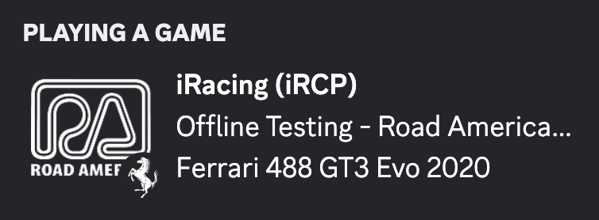

# iRPC

A lightweight Windows system tray app that displays your iRacing session as Discord Rich Presence — live track, car, position, lap progress, and more.



---

## Features

- Live session info in Discord: track, car, session type, position, lap progress, time remaining
- Custom track and car brand logos via Discord Art Assets
- Session type icons (Practice, Qualify, Race, Test Drive, Time Trial)
- Elapsed session timer
- Caution and checkered flag indicators
- Launches on Windows startup (optional)
- Automatic update checks via GitHub Releases
- Fully configurable — toggle each field on or off

---

## Installation

1. Download `iRPC.exe` from the [latest release](https://github.com/Mathues-Studios/iRPC/releases/latest)
2. Run it — a tray icon appears in the system tray
3. Open iRacing and start a session

No installation required. No .NET runtime is needed.

---

## Discord Setup

iRPC uses a Discord application to display Rich Presence. The default App ID points to the official iRPC app which includes pre-uploaded track and brand logos.

If you want to use your own Discord application:

1. Go to [discord.com/developers/applications](https://discord.com/developers/applications) and create a new app
2. Copy the Application ID and paste it into iRPC's Settings → Discord App ID
3. Upload your own art assets under **Rich Presence → Art Assets**

### Art Asset Keys

Keys follow a prefixed naming convention — lowercase, spaces replaced with underscores.

| Type         | Example name      | Key               |
|--------------|-------------------|-------------------|
| Track        | Spa               | `track_spa`       |
| Car brand    | Ferrari 296 GT3   | `brand_ferrari`   |
| Session icon | Practice          | `icon_practice`   |

Session type icon keys: `icon_practice`, `icon_qualify`, `icon_race`, `icon_test_drive`, `icon_time_trial`

Static keys: `iracing_logo`, `irpc_logo`

If a track has multiple configs and you want them all to share one image, use `key_overrides.json` to remap — e.g. `track_watkins_glen_boot` → `track_watkins_glen`.

Check `%AppData%\iRPC\iRPC.log` to see exactly which keys the app is resolving. You can also remap any key by editing `%AppData%\iRPC\key_overrides.json`.

---

## Settings

Right-click the tray icon → **Settings**

| Setting             | Description                                         |
|---------------------|-----------------------------------------------------|
| Discord App ID      | The Discord application to use for Rich Presence    |
| Large icon          | iRacing logo, iRPC logo, or track logo              |
| Small icon          | Off, car brand logo, or session type icon           |
| Show car name       | Display the current car in the presence state       |
| Show lap progress   | Display current lap / total laps                    |
| Show position       | Display race position (race sessions only)          |
| Show time remaining | Display remaining session time                      |
| Show flag indicator | Display caution or checkered flag status            |
| Show elapsed timer  | Display elapsed session time as a Discord timestamp |
| Show GitHub button  | Show a link to this repo on the presence            |
| Launch on startup   | Start iRPC automatically with Windows               |

---

## Building from Source

Requires [.NET 8 SDK](https://dotnet.microsoft.com/download/dotnet/8) on Windows.

```powershell
git clone https://github.com/Mathues-Studios/iRPC.git
cd iRPC
dotnet run
```

To build a standalone executable:

```powershell
dotnet publish -c Release -r win-x64 --self-contained -p:PublishSingleFile=true -o publish/
```

---

## Logs & Data Files

| File | Contents |
|---|---|
| `%AppData%\iRPC\iRPC.log` | Debug log — poll ticks, YAML updates, asset keys resolved |
| `%AppData%\iRPC\tracks.txt` | Every unique track seen, auto-appended on each new session |
| `%AppData%\iRPC\key_overrides.json` | Custom asset key remappings (e.g. `track_imola_full` → `track_imola`) |
| `%AppData%\iRPC\settings.json` | App settings |
